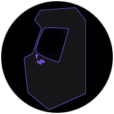
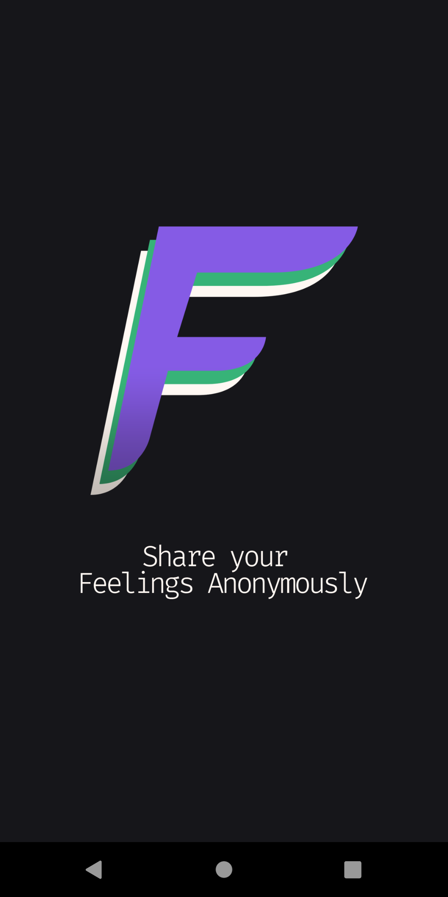
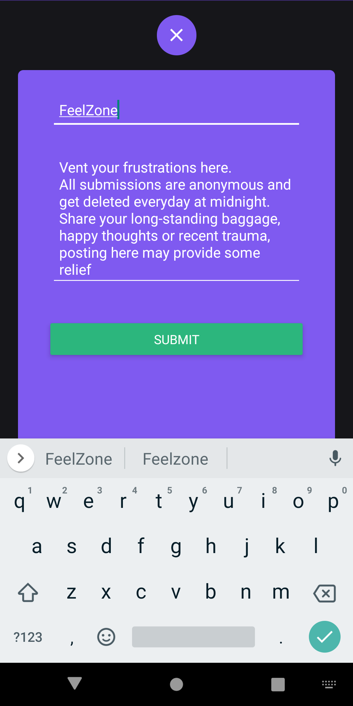
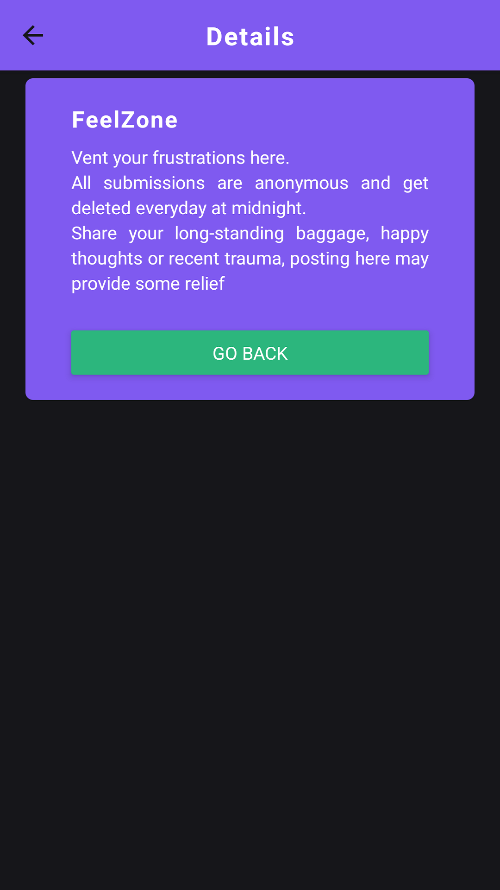
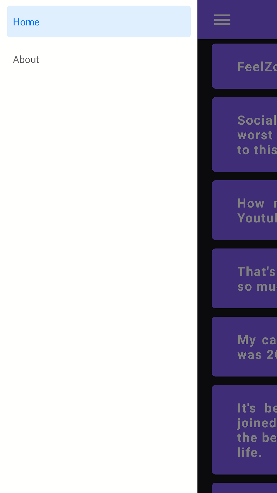
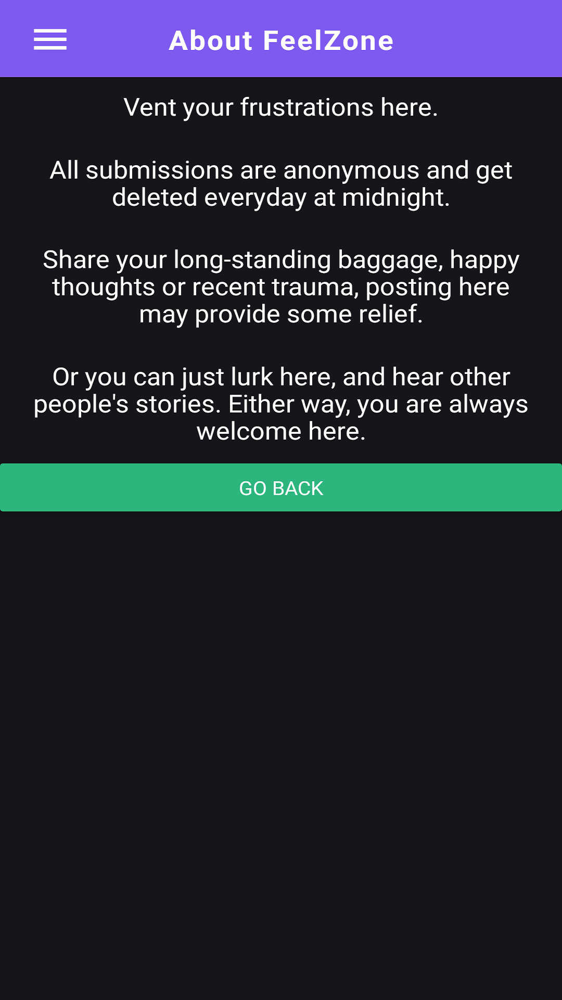

    
    
    
    
    

# FeelZone: Share your Feelings Anonymously

## Description

Vent your frustrations here. All submissions are anonymous and get deleted everyday at midnight. Share your long-standing baggage, happy thoughts or recent trauma, posting here may provide some relief. Or you can just lurk here, and hear other people's stories. Either way, you are always welcome here.

[Back To The Top](#Description)

#### Tecnologies

- React Native
- React Navigation
- Expo CLI
- Axios
- Formik
- Yup

## Instalation

Clone/download this repository into your computer:

`git clone https://github.com/alissonsleal/FeelZone`

Go into the folder where you downloaded and run:

`npm install`

To open the expo server, just run:

`expo start`

## How To Use the App

The first thing you'll see is the loading page:

You can just lurk and read other people's stories from the homepage. If you want to share your story, just click the green button on the bottom right corner of the app.

After this, you just have to add a title and a description and then just click the submit button.

After this, you'll be able to see your story in the homepage, if you click it, you'll be able to see the details.

If you swipe left or click on the hamburger menu button, you'll be able to see the about page:

If you open About, you'll be redirected to the about page:

[Back To The Top](#Description)

## License

MIT License

Copyright (c) 2020 Alisson Leal

Permission is hereby granted, free of charge, to any person obtaining a copy
of this software and associated documentation files (the "Software"), to deal
in the Software without restriction, including without limitation the rights
to use, copy, modify, merge, publish, distribute, sublicense, and/or sell
copies of the Software, and to permit persons to whom the Software is
furnished to do so, subject to the following conditions:

The above copyright notice and this permission notice shall be included in all
copies or substantial portions of the Software.

THE SOFTWARE IS PROVIDED "AS IS", WITHOUT WARRANTY OF ANY KIND, EXPRESS OR
IMPLIED, INCLUDING BUT NOT LIMITED TO THE WARRANTIES OF MERCHANTABILITY,
FITNESS FOR A PARTICULAR PURPOSE AND NONINFRINGEMENT. IN NO EVENT SHALL THE AUTHORS OR COPYRIGHT HOLDERS BE LIABLE FOR ANY CLAIM, DAMAGES OR OTHER LIABILITY, WHETHER IN AN ACTION OF CONTRACT, TORT OR OTHERWISE, ARISING FROM, OUT OF OR IN CONNECTION WITH THE SOFTWARE OR THE USE OR OTHER DEALINGS IN THE SOFTWARE.

[Back To The Top](#Description)

---

## Author Info

- Twitter - [@alissonsleal](https://twitter.com/alissonsleal)
- Discord - [Alisson#0629](https://discord.com/)
- StackOverflow - [Alisson Leal](https://stackoverflow.com/users/14122260/alisson-leal)

[Back To The Top](#Description)
